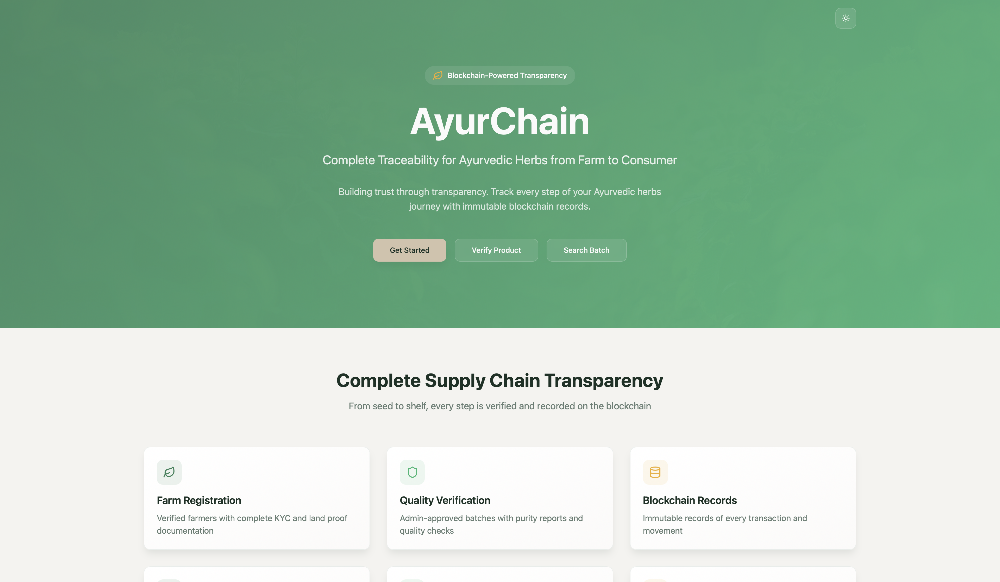
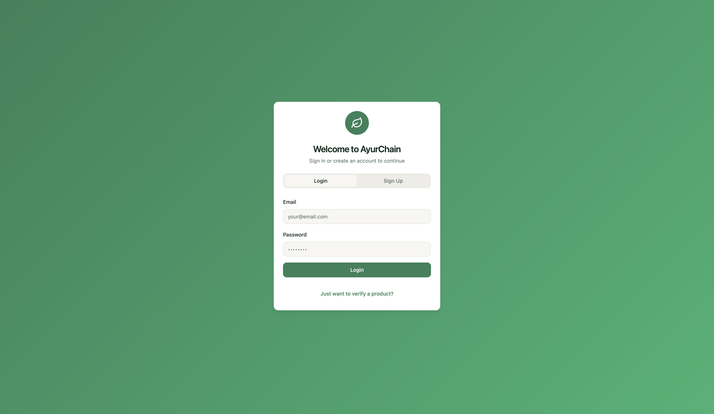
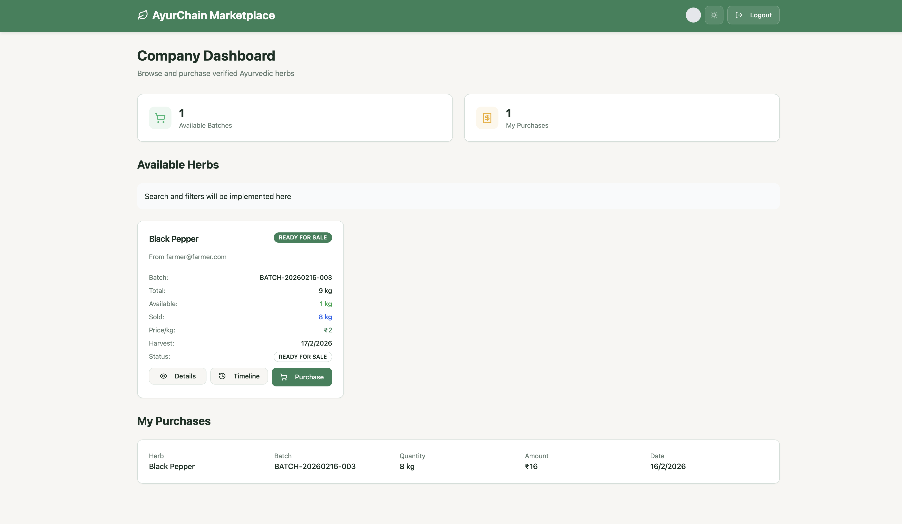
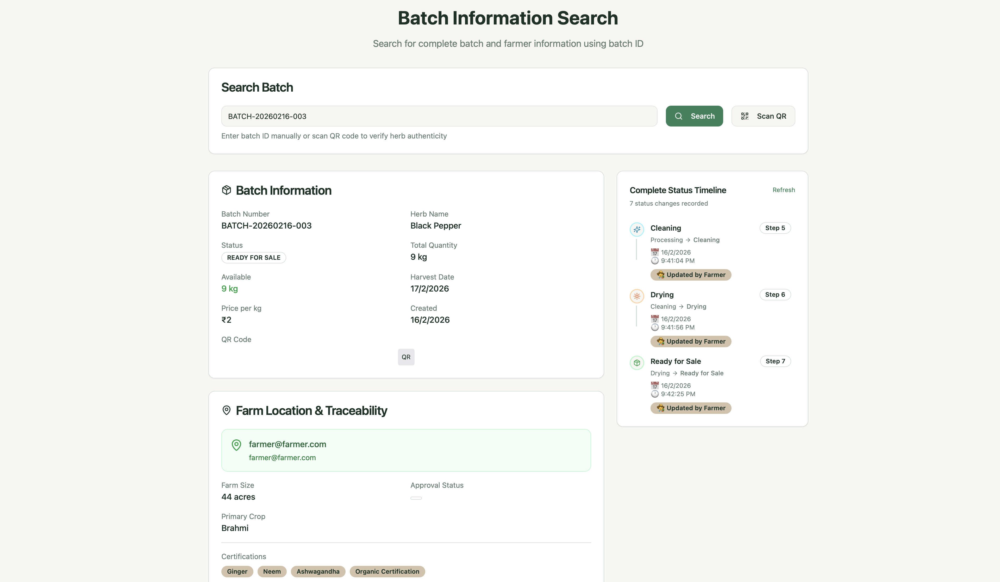
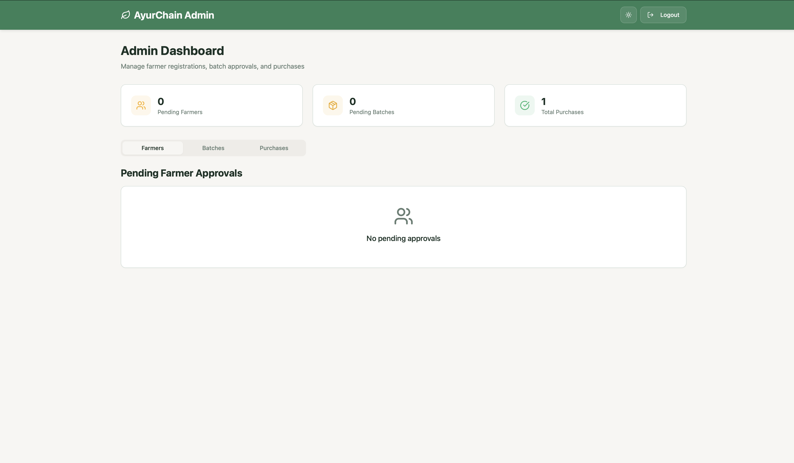

# AyurChain 🌿


> Complete Traceability for Ayurvedic Herbs from Farm to Consumer using Blockchain Technology

AyurChain is a comprehensive supply chain traceability platform for Ayurvedic herbs, providing complete transparency from farm to consumer using blockchain-powered immutable records.

---

## 📋 Table of Contents

- [🌟 Features](#🌟-features)
- [🛠️ Tech Stack](#🛠️-tech-stack)
- [🏗️ Architecture](#🏗️-architecture)
- [🚀 Getting Started](#🚀-getting-started)
- [📱 Application Screenshots](#📱-application-screenshots)
- [📁 Project Structure](#📁-project-structure)
- [🔐 User Roles](#🔐-user-roles)
- [📊 API Endpoints](#📊-api-endpoints)
- [🤝 Contributing](#🤝-contributing)
- [📄 License](#📄-license)

---

## 🌟 Features

### Multi-Stakeholder Platform
- **Farmers**: Create and manage herb batches with complete traceability
- **Admins**: Approve farmers and verify batch quality
- **Companies**: Purchase verified herbs with transparent pricing
- **Consumers**: Verify product authenticity and view complete journey

### Complete Traceability
- **Batch Creation**: Record harvest details, farming conditions, and quality metrics
- **Status Tracking**: Real-time status updates with timeline progression
- **Document Management**: Land proof, certifications, and purity reports
- **Blockchain Records**: Immutable transaction records

### 🔔 Real-time Notifications
- **Instant Alerts**: Farmers receive notifications when companies purchase their batches
- **Detailed Purchase History**: Complete sales history with buyer information
- **Earnings Tracking**: Clear breakdown of farmer earnings (80%) and platform fees (20%)

### 🌙 Dark Mode & Enhanced UX
- **Dark Mode Toggle**: System-aware theme switching with manual override
- **PDF Export**: Generate detailed sales history reports
- **Advanced Search & Filters**: Powerful filtering by status, date, quantity

### 📱 QR Code System
- **QR Code Generation**: Automatic QR code creation for each batch
- **Download & Print**: Export QR codes as PNG files or print labels
- **QR Scanner**: Built-in camera scanner for batch verification
- **Mobile Verification**: Scan QR codes to instantly verify batch authenticity

### 🗺️ Location & Mapping
- **Farm Location Maps**: Interactive maps showing exact farm locations
- **Address Verification**: Complete farm address display with map integration
- **External Map Links**: Direct links to Google Maps and OpenStreetMap

---

## 🛠️ Tech Stack

### Frontend
| Technology | Purpose |
|------------|---------|
| React 18 | UI Framework |
| TypeScript | Type Safety |
| Vite | Build Tool |
| Tailwind CSS | Styling |
| shadcn/ui | Component Library |
| React Router v6 | Routing |
| React Query | Data Fetching |
| Socket.io Client | Real-time Updates |

### Backend
| Technology | Purpose |
|------------|---------|
| Node.js | Runtime |
| Express.js | Web Framework |
| MongoDB | Database |
| Mongoose | ODM |
| JWT | Authentication |
| Socket.io | Real-time Communication |
| QRCode | QR Generation |

### Development Tools
| Technology | Purpose |
|------------|---------|
| Docker | Containerization |
| ESLint | Code Linting |
| TypeScript | Type Checking |

---

## 🏗️ Architecture

```
+-------------------------------------------------------------+
|                        AYURCHAIN                            |
+-------------------------------------------------------------+
|                                                             |
|   +-----------------+     +-----------------+             |
|   |   FRONTEND      |     |    BACKEND      |             |
|   |   (React/Vite)  |<--->|  (Node/Express) |             |
|   +--------+--------+     +--------+--------+             |
|            |                        |                       |
|            |              +---------+---------+            |
|            |              |                   |            |
|            |              v                   v            |
|            |     +--------------+  +--------------+       |
|            |     |   MongoDB    |  |  Socket.io   |       |
|            |     |  (Database)  |  |  (Real-time) |       |
|            |     +--------------+  +--------------+       |
|            |                                                |
|            v                                                |
|   +---------------------------------------+                |
|   |          USER ROLES                   |                |
|   |  Farmer  Admin  Company  Consumer     |                |
|   +---------------------------------------+                |
|                                                             |
+-------------------------------------------------------------+
```

### Data Flow
1. **Farmer** creates batch -> **Backend** stores in MongoDB -> **QR Code** generated
2. **Admin** verifies batch -> **Status updated** -> **Notification** sent
3. **Company** purchases batch -> **Payment split** (80/20) -> **Farmer notified**
4. **Consumer** scans QR -> **Complete traceability** displayed

---

## 🚀 Getting Started

### Prerequisites

| Requirement | Version |
|-------------|---------|
| Node.js | 18+ |
| MongoDB | 6.0+ |
| npm | 9.0+ |

### Installation

1. **Clone the repository**
```bash
git clone https://github.com/shivam-dewangan/AyurChain.git
cd AyurChain
```

2. **Backend Setup**
```bash
cd backend
cp .env.example .env
# Edit .env with your configuration

# Install dependencies
npm install

# Start MongoDB (macOS)
brew services start mongodb/brew/mongodb-community

# Run backend
npm run dev
```

3. **Frontend Setup**
```bash
cd frontend
cp .env.example .env
# Edit .env with your configuration

# Install dependencies
npm install

# Run frontend
npm run dev
```

### Environment Variables

#### Backend (.env)
```env
PORT=5000
NODE_ENV=development
MONGODB_URI=mongodb://localhost:27017/ayurchain
JWT_SECRET=your-secret-key
FRONTEND_URL=http://localhost:5173
```

#### Frontend (.env)
```env
VITE_API_URL=http://localhost:5000/api
VITE_WS_URL=http://localhost:5000
```

### Running with Docker

```bash
# Using run.sh script
./run.sh

# Manual Docker commands
docker-compose up -d
```

### Access the Application

| Service | URL |
|---------|-----|
| Frontend | http://localhost:5173 |
| Backend API | http://localhost:5000 |
| Health Check | http://localhost:5000/api/health |

---

## 📱 Application Screenshots

### Screenshot 1: Landing Page


The landing page showcases AyurChain's mission to provide complete traceability for Ayurvedic herbs. It includes:
- Hero section with blockchain transparency message
- Feature highlights (Farm Registration, Quality Verification, Blockchain Records, QR Tracking)
- "How It Works" section explaining the workflow
- Call-to-action buttons for Get Started, Verify Product, and Search Batch

---

### Screenshot 2: Authentication Page


Secure authentication system with:
- Login/Signup toggle
- Role selection (Farmer, Company, Admin)
- Form validation
- Error handling

---

### Screenshot 3: Farmer Dashboard


Comprehensive farmer dashboard featuring:
- My Batches tab with status tracking (Pending -> Approved -> Ready for Sale -> Sold)
- Sales History with detailed buyer information
- Real-time notification bell with purchase alerts
- Batch timeline showing progress
- QR code generation for each batch

---

### Screenshot 4: Company Dashboard


Company marketplace with:
- Browse approved herb batches
- Advanced search and filters
- Batch details modal with farmer information
- Farm location map integration
- Purchase functionality with payment breakdown

---

### Screenshot 5: Verification Page


Consumer verification system:
- QR code scanner with camera access
- Batch verification results
- Complete traceability journey
- Farmer profile and batch history
- Quality metrics and authenticity confirmation


### Screenshot 6: Admin Page



---

## 📁 Project Structure

```
AyurChain/
├── backend/                    # Node.js + Express API
│   ├── config/                 # Configuration files
│   │   ├── db.js              # MongoDB connection
│   │   └── index.js           # Environment config
│   ├── middleware/            # Express middleware
│   │   ├── auth.js           # JWT authentication
│   │   └── role.js           # Role-based access
│   ├── models/               # Mongoose models
│   │   ├── User.js           # User schema
│   │   ├── Batch.js          # Batch schema
│   │   ├── Purchase.js       # Purchase schema
│   │   ├── FarmerDetail.js   # Farmer profile
│   │   ├── CompanyDetail.js  # Company profile
│   │   ├── Notification.js   # Notification schema
│   │   ├── AIAnalysis.js    # AI quality analysis
│   │   └── FraudDetection.js # Fraud detection
│   ├── routes/               # API routes
│   │   ├── auth.js          # Authentication
│   │   ├── batches.js       # Batch management
│   │   ├── purchases.js     # Purchase handling
│   │   ├── profiles.js      # Profile management
│   │   ├── admin.js         # Admin operations
│   │   └── ai.js            # AI features
│   ├── services/            # Business logic
│   │   ├── inventoryService.js
│   │   └── qrService.js
│   ├── package.json
│   └── server.js            # Express server
│
├── frontend/                  # React + Vite Application
│   ├── public/              # Static assets
│   ├── src/
│   │   ├── api/            # API client
│   │   ├── components/     # React components
│   │   │   ├── ui/         # shadcn/ui components
│   │   │   ├── BatchDetailsModal.tsx
│   │   │   ├── BatchQRCode.tsx
│   │   │   ├── BatchTimeline.tsx
│   │   │   ├── FarmLocationMap.tsx
│   │   │   ├── NotificationBell.tsx
│   │   │   ├── QRScanner.tsx
│   │   │   └── ThemeToggle.tsx
│   │   ├── contexts/       # React contexts
│   │   ├── hooks/          # Custom hooks
│   │   ├── lib/            # Utilities
│   │   ├── pages/          # Page components
│   │   │   ├── Landing.tsx
│   │   │   ├── Auth.tsx
│   │   │   ├── FarmerDashboard.tsx
│   │   │   ├── CompanyDashboard.tsx
│   │   │   ├── AdminDashboard.tsx
│   │   │   ├── CreateBatch.tsx
│   │   │   ├── BatchSearch.tsx
│   │   │   └── Verify.tsx
│   │   ├── services/       # Frontend services
│   │   ├── App.tsx         # Main app component
│   │   └── main.tsx        # Entry point
│   ├── package.json
│   ├── vite.config.ts
│   └── tailwind.config.ts
│
├── docs/                     # Documentation
│   └── screenshots/         # Application screenshots
│
├── run.sh                   # Application launcher
├── start.sh                 # Startup script
├── docker-compose.yml       # Docker configuration
└── README.md               # This file
```

---

## 🔐 User Roles

### 👨‍🌾 Farmer
- Register with KYC and land proof
- Create and manage herb batches
- View sales history and earnings
- Receive real-time purchase notifications

### 👨‍💼 Admin
- Verify farmer registrations
- Approve/reject batch quality
- Manage platform users
- View analytics dashboard

### 🏢 Company
- Browse approved herb batches
- Purchase herbs with transparent pricing
- View complete batch history
- Access farm location information

### 👤 Consumer
- Scan QR codes for verification
- View complete product journey
- Verify authenticity
- Access farmer profile information

---

## 📊 API Endpoints

### Authentication
| Method | Endpoint | Description |
|--------|----------|-------------|
| POST | `/api/auth/register` | Register new user |
| POST | `/api/auth/login` | User login |
| GET | `/api/auth/me` | Get current user |

### Batches
| Method | Endpoint | Description |
|--------|----------|-------------|
| GET | `/api/batches` | Get all batches |
| POST | `/api/batches` | Create new batch |
| GET | `/api/batches/:id` | Get batch by ID |
| PUT | `/api/batches/:id` | Update batch |
| DELETE | `/api/batches/:id` | Delete batch |

### Purchases
| Method | Endpoint | Description |
|--------|----------|-------------|
| GET | `/api/purchases` | Get user purchases |
| POST | `/api/purchases` | Create purchase |

### Profiles
| Method | Endpoint | Description |
|--------|----------|-------------|
| GET | `/api/profiles/farmer` | Get farmer profile |
| PUT | `/api/profiles/farmer` | Update farmer profile |
| GET | `/api/profiles/company` | Get company profile |
| PUT | `/api/profiles/company` | Update company profile |

### Admin
| Method | Endpoint | Description |
|--------|----------|-------------|
| GET | `/api/admin/farmers` | List all farmers |
| PUT | `/api/admin/farmers/:id/verify` | Verify farmer |
| GET | `/api/admin/batches/pending` | Get pending batches |
| PUT | `/api/admin/batches/:id/approve` | Approve batch |

### AI
| Method | Endpoint | Description |
|--------|----------|-------------|
| POST | `/api/ai/analyze` | Analyze batch quality |

---

## 📈 Workflow

```
+-----------------+     +-----------------+     +-----------------+
|   FARMER        |     |     ADMIN       |     |    COMPANY      |
|   REGISTRATION  |---->|   VERIFICATION  |---->|    PURCHASE     |
+-----------------+     +-----------------+     +-----------------+
        |                       |                       |
        v                       v                       v
+-----------------+     +-----------------+     +-----------------+
|  Create Batch  |---->|  Quality Check  |---->|  View Batches   |
|  with Details   |     |  & Approval     |     |  & Purchase     |
+-----------------+     +-----------------+     +-----------------+
                                                        |
                                                        v
                                         +-------------------------+
                                         |   PAYMENT SPLIT         |
                                         |   80% Farmer            |
                                         |   20% Platform          |
                                         +-------------------------+
                                                        |
                                                        v
                                         +-------------------------+
                                         |   CONSUMER VERIFICATION |
                                         |   Scan QR -> View Journey|
                                         +-------------------------+
```

---

## 🤝 Contributing

1. Fork the repository
2. Create your feature branch (`git checkout -b feature/amazing-feature`)
3. Commit your changes (`git commit -m 'Add some amazing feature'`)
4. Push to the branch (`git push origin feature/amazing-feature`)
5. Open a Pull Request

---

## 📄 License

This project is licensed under the MIT License - see the [LICENSE](LICENSE) file for details.

---

## 🙏 Acknowledgments

- [React](https://react.dev/)
- [Node.js](https://nodejs.org/)
- [MongoDB](https://www.mongodb.com/)
- [Tailwind CSS](https://tailwindcss.com/)
- [shadcn/ui](https://ui.shadcn.com/)

---

## 📞 Support

For support and questions:
- Email: support@ayurchain.com
- GitHub Issues: [Open an issue](https://github.com/shivam-dewangan/AyurChain/issues)

---

<div align="center">

**Built with ❤️ for transparent Ayurvedic supply chain**

*AyurChain v1.0.0*

</div>

